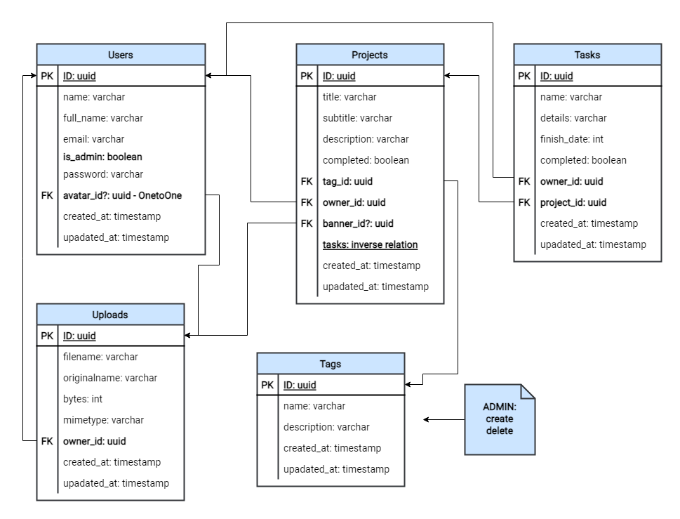

<div align="center">
  
  <h3>NodeJS REST API, gerenciamento de projetos e tarefas.</h3>

  <p align="center">
    API REST desenvolvida no NodeJS visando o gerenciamento ✅ de projetos/tarefas.<br/> 
    Construída com TypeScript, PostgresSQL, entre outros.
  </p>  
</div>

<div align="center">
  

  

  

  

  

  <a href="https://github.com/prettier/prettier">
    
  </a>
</div>

<p align="center">
  <small>Build with ❤️ by: <a href="https://github.com/lucasbernardol">José Lucas</a></small>
</p>

## Demonstração (demo)

Olá :wave:, você pode visualizar e testar o projeto agora mesmo, basta
acessar: [Tasks API - DEMO :earth_americas:](https://tasksnode-api.herokuapp.com/)

Observação: a aplicação está hospedada no [Heroku](https://www.heroku.com/)

## :wrench: Como executar no ambiente local?

### :information_source: Requisitos mínimos

1. NodeJS na versão **16.x** ou superior.
2. Gerenciadores de pacotes como: `npm`, `pnpm` ou `yarn`.

#### Configurações do ambiente

- Antes de iniciar o servidor de desenvolvimento
  é primordial configurar algumas variáves de ambiente. Crie um arquivo chamado `.env` na raiz do projeto, copie o conteúdo do `.env.example` para o `.env`, e preencha os seus valores.

### Guia de instalação

1. Faça um clone do repositório através do git. Use o comando abaixo:

```bash
$ git clone https://github.com/lucasbernardol/tasks-api.git

$ cd tasks-api/
```

2. Instale todas as dependências necessárias com um gerenciador de pacotes
   de sua preferência. Em casos de dúvidas, veja documentação das ferramentas mais usadas: `npm`, `pnpm` ou `yarn`

```bash
$ yarn install
```

3. Na última etapa podemos iniciar o servidor de desenvolvimento. Execute o seguinte
   comando no seu terminal: `yarn dev`. Você pode criar e modificar "scripts" no arquivo `package.json`! Fique à vontade.

```bash
$ yarn dev
```

### Iniciando os testes (API)

Existem diversas formas de realizar testes em uma API, e para
aumentar a produtividade/facilidade dos testes, podemos utilizar alguns softwares
específicos que desempenham esse papel. Veja a tabela abaixo:

| Software (API clients)                         | Download                                   |
| ---------------------------------------------- | ------------------------------------------ |
| Insomnia - baseado Electron (**recomendação**) | [Download](https://insomnia.rest/download) |
| Postman                                        | [Download](https://www.postman.com/)       |
| Hoppscotch - online e open source              | [Online](https://hoppscotch.io/pt-br)      |

### :pushpin: Endpoints ou rotas

- Abaixo você encontra uma tabela com os principais "endpoints" da aplicação:

| Endpoints     | Métodos HTTP                     | Descrição                          |
| ------------- | -------------------------------- | ---------------------------------- |
| /             | **GET**                          | Endpoint principal                 |
| /api/users    | **GET**                          | Enpoint de usuários                |
| /api/sessions | **Todos os médotos dispovíveis** | Autenticação                       |
| /api/tags     | **Todos os médotos dispovíveis** | Gerenciamento de tags              |
| /api/uploads  | **Todos os médotos dispovíveis** | Upload de imagens (.jpg, png...)   |
| /api/projects | **Todos os médotos dispovíveis** | Gerenciamento de projetos          |
| /api/tasks    | **Todos os médotos dispovíveis** | Tarefas (associadas com projectos) |

> Observação: veja o arquivo Insomnia.json na raiz do projeto, ele contém uma breve documentação com todos os endpoints.

## :file_folder: Estrutura do banco de dados

- Diagrama do banco de dados **PostgresSQL** e a estrura do projeto:



## :boy: Autor

<table class="author">
  <tr>
    <td align="center">
      <a href="https://github.com/lucasbernardol">
        
        <br/>
        <sub>
          <b>José Lucas</b>
        </sub>
      </a>
    </td>
  </tr>
</table>

## 📝 Licença

O projeto o possui a licença _MIT_, veja o arquivo [LICENÇA](LICENSE) para mais informações.
